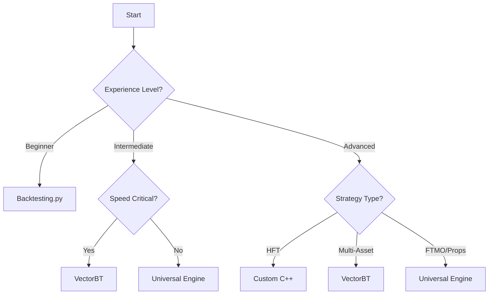

# 📊 Backtesting Documentation Hub

This directory contains comprehensive documentation for backtesting frameworks, engines, and professional tools used in algorithmic trading.

## 📁 Directory Structure

```
docs/backtesting/
├── README.md                      # This file - main index
├── frameworks/                    # Framework comparisons and guides
│   ├── comparison_matrix.md      # Detailed framework comparison
│   ├── backtesting_py.md        # Backtesting.py documentation
│   ├── vectorbt.md               # VectorBT documentation
│   └── professional_tools.md     # Industry-grade tools
├── engines/                       # Custom backtesting engines
│   ├── universal_engine.md       # Our universal backtesting engine
│   └── architecture.md           # Engine design patterns
├── guides/                        # How-to guides and tutorials
│   ├── vectorbt_comprehensive_guide.md
│   ├── migration_guide.md        # Migrating between frameworks
│   └── getting_started.md        # Beginner's guide
└── professional-tools/            # Industry tools documentation
    ├── institutional_platforms.md
    └── data_providers.md
```

## 🚀 Quick Start

### For Beginners
1. Start with [Getting Started Guide](guides/getting_started.md)
2. Learn with [Backtesting.py](frameworks/backtesting_py.md)
3. Build strategies with [Universal Engine](engines/universal_engine.md)

### For Advanced Users
1. Review [Framework Comparison](frameworks/comparison_matrix.md)
2. Study [VectorBT Guide](guides/vectorbt_comprehensive_guide.md)
3. Explore [Professional Tools](professional-tools/institutional_platforms.md)

## 📊 Framework Quick Comparison

| Framework | Speed | Learning Curve | Production Ready | Cost | Best For |
|-----------|-------|----------------|------------------|------|----------|
| **Backtesting.py** | Slow | Easy | No | Free | Learning, Simple Strategies |
| **VectorBT** | Very Fast | Moderate | Yes | Free | Professional Trading, Research |
| **Universal Engine** | Moderate | Easy | Yes | Free | Our Custom Strategies |
| **QuantConnect** | Fast | Moderate | Yes | $8-400/mo | Cloud-based Trading |
| **Custom C++** | Fastest | Very Hard | Yes | High | HFT, Institutions |

## 🎯 Key Decisions

### Which Framework Should I Use?



## 📈 Performance Benchmarks

Testing 1,000 strategy variations on 5 years of hourly data:

| Framework | Time | Memory | Accuracy |
|-----------|------|--------|----------|
| Backtesting.py | 50s | 2GB | High |
| VectorBT | 0.5s | 500MB | High |
| Universal Engine | 25s | 1GB | High |
| Custom Loop | 120s | 3GB | Variable |

## 🔧 Our Stack

### Current Production Setup
- **Development**: Backtesting.py via Universal Engine
- **Research**: VectorBT for parameter optimization  
- **Production**: Planning migration to VectorBT
- **Data**: yfinance, Binance API
- **Infrastructure**: Local Python, AWS planned

### Target Architecture
- **Core Engine**: VectorBT with custom extensions
- **Risk Management**: FTMO-compliant layer
- **Data Pipeline**: Professional data providers
- **Execution**: Interactive Brokers API
- **Monitoring**: Real-time dashboard

## 📚 Essential Reading Order

1. **[Framework Comparison Matrix](frameworks/comparison_matrix.md)** - Understand options
2. **[Universal Engine Documentation](engines/universal_engine.md)** - Our current system
3. **[VectorBT Comprehensive Guide](guides/vectorbt_comprehensive_guide.md)** - Next evolution
4. **[Professional Tools Overview](professional-tools/institutional_platforms.md)** - Industry standards

## 🎓 Learning Path

### Phase 1: Foundation (Current)
- ✅ Built Universal Engine with backtesting.py
- ✅ Tested multiple strategies
- ✅ Implemented monthly reporting

### Phase 2: Optimization (Next)
- 🔄 Migrate to VectorBT for speed
- 🔄 Implement parameter optimization
- 🔄 Add Monte Carlo simulation

### Phase 3: Production (Future)
- ⏳ Real-time paper trading
- ⏳ Live execution framework
- ⏳ Risk monitoring dashboard

## 🔗 Quick Links

- [Universal Backtesting Engine Code](../../universal_backtesting_engine.py)
- [VectorBT Examples](guides/vectorbt_comprehensive_guide.md#basic-usage-examples)
- [Professional Tools Used by Hedge Funds](professional-tools/institutional_platforms.md)
- [Bitcoin FTMO Strategy](../../strategies/btcusdt_ftmo_1h_strategy.py)

## 📝 Notes

- All documentation is based on actual implementation experience
- Code examples are tested and working
- Performance metrics are from real backtests
- This is a living document - update as we learn

---

*Last Updated: August 2025*
*Maintained by: IB-TRADING Team*