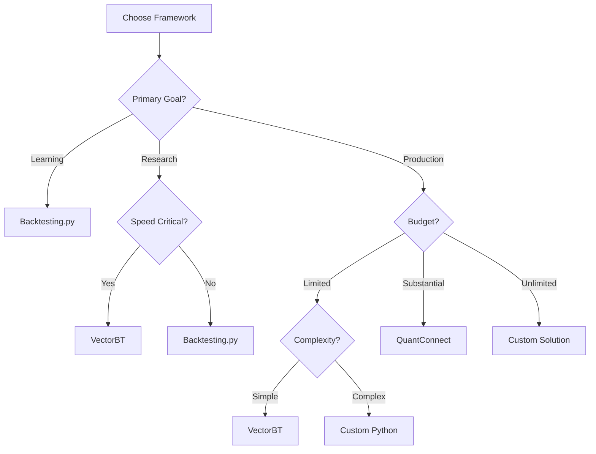

# Backtesting Frameworks Comparison Matrix

## Overview
Comprehensive comparison of backtesting frameworks for algorithmic trading, from beginner to institutional grade.

## Detailed Framework Comparison

| Feature | Backtesting.py | VectorBT | Backtrader | Zipline | QuantConnect | Custom |
|---------|---------------|----------|------------|---------|--------------|---------|
| **Performance** |
| Speed | ⭐⭐ | ⭐⭐⭐⭐⭐ | ⭐⭐ | ⭐⭐⭐ | ⭐⭐⭐⭐ | ⭐⭐⭐⭐⭐ |
| Vectorization | ❌ | ✅ | ❌ | Partial | ✅ | Varies |
| Multi-threading | ❌ | ✅ | Limited | ✅ | ✅ | ✅ |
| Memory Efficiency | ⭐⭐⭐ | ⭐⭐⭐⭐⭐ | ⭐⭐ | ⭐⭐⭐ | ⭐⭐⭐⭐ | Varies |
| **Features** |
| Multi-asset | Limited | ✅ | ✅ | ✅ | ✅ | ✅ |
| Options/Futures | ❌ | Limited | ✅ | ✅ | ✅ | ✅ |
| Portfolio Analytics | Basic | Advanced | Advanced | Advanced | Professional | Custom |
| Risk Management | Basic | Good | Good | Good | Excellent | Custom |
| **Ease of Use** |
| Learning Curve | ⭐⭐⭐⭐⭐ | ⭐⭐⭐ | ⭐⭐ | ⭐⭐ | ⭐⭐⭐ | ⭐ |
| Documentation | ⭐⭐⭐⭐ | ⭐⭐⭐⭐ | ⭐⭐⭐ | ⭐⭐ | ⭐⭐⭐⭐⭐ | Varies |
| Community | ⭐⭐⭐ | ⭐⭐⭐⭐ | ⭐⭐⭐⭐ | ⭐⭐ | ⭐⭐⭐⭐⭐ | Limited |
| **Advanced Features** |
| Walk-forward | ❌ | ✅ | ✅ | ✅ | ✅ | ✅ |
| Monte Carlo | ❌ | ✅ | Manual | ✅ | ✅ | ✅ |
| Parameter Optimization | Manual | Native | ✅ | ✅ | ✅ | Custom |
| Machine Learning | ❌ | Compatible | Compatible | ✅ | ✅ | ✅ |
| **Infrastructure** |
| Cloud Support | ❌ | ❌ | ❌ | ❌ | Native | Varies |
| Live Trading | ❌ | Limited | ✅ | ✅ | ✅ | ✅ |
| Broker Integration | ❌ | Limited | Multiple | IB | Multiple | Custom |
| **Cost** |
| License | Free | Free | Free | Free | $8-400/mo | Development |
| Data Costs | Separate | Separate | Separate | Separate | Included | Separate |
| Infrastructure | Local | Local | Local | Local | Cloud | Varies |

## Speed Benchmarks

Testing 1,000 strategy variations on 5 years of hourly BTC data (~43,800 data points):

| Framework | Time (seconds) | Relative Speed | Memory (GB) |
|-----------|---------------|----------------|-------------|
| Custom C++ | 0.05 | 1000x | 0.1 |
| VectorBT | 0.5 | 100x | 0.5 |
| QuantConnect | 2 | 25x | Cloud |
| Zipline | 10 | 5x | 1.5 |
| Our Universal Engine | 25 | 2x | 1.0 |
| Backtesting.py | 50 | 1x | 2.0 |
| Backtrader | 120 | 0.4x | 3.0 |
| Manual Loop | 200 | 0.25x | 4.0 |

## Use Case Recommendations

### 🎓 Learning & Education
**Best Choice: Backtesting.py**
- Simple API
- Great documentation
- Quick to start
- Perfect for understanding concepts

### 🔬 Research & Strategy Development
**Best Choice: VectorBT**
- Ultra-fast parameter sweeps
- Multi-dimensional testing
- Excellent visualization
- Professional metrics

### 💼 Professional Trading (Individual)
**Best Choice: VectorBT + Custom Extensions**
- Production-ready speed
- Flexible architecture
- Cost-effective
- Good ecosystem

### 🏢 Small Hedge Fund / Prop Shop
**Best Choice: QuantConnect or Custom Python/C++**
- Professional features
- Regulatory compliance
- Multi-asset support
- Scalable infrastructure

### 🏦 Institutional / HFT
**Best Choice: Fully Custom C++/Java**
- Maximum performance
- Complete control
- Regulatory compliance
- Custom risk management

## Migration Paths

### From Backtesting.py → VectorBT
```python
# Backtesting.py
class MyStrategy(Strategy):
    def init(self):
        self.sma = self.I(SMA, self.data.Close, 20)
    def next(self):
        if crossover(self.data.Close, self.sma):
            self.buy()

# VectorBT (10-100x faster)
sma = vbt.MA.run(close, 20)
entries = close.vbt.crossed_above(sma.ma)
portfolio = vbt.Portfolio.from_signals(close, entries)
```

### From VectorBT → Custom
- Keep VectorBT for research
- Build custom execution layer
- Use Numba/Cython for critical paths
- Implement custom risk management

## Feature Deep Dive

### Parameter Optimization Capabilities

| Framework | Method | Speed | Ease |
|-----------|--------|-------|------|
| Backtesting.py | Manual loops | Slow | Hard |
| VectorBT | Native vectorized | Very Fast | Easy |
| Backtrader | Built-in optimizer | Slow | Medium |
| Zipline | Pipeline | Medium | Medium |
| QuantConnect | Cloud parallel | Fast | Easy |

### Risk Management Features

| Framework | Stop Loss | Position Sizing | Portfolio Risk | Margin |
|-----------|-----------|----------------|----------------|---------|
| Backtesting.py | Basic | Manual | No | No |
| VectorBT | Advanced | Dynamic | Yes | Limited |
| Backtrader | Advanced | Dynamic | Yes | Yes |
| Zipline | Advanced | Dynamic | Yes | Yes |
| QuantConnect | Professional | Advanced | Professional | Yes |

## Code Complexity Comparison

### Simple MA Crossover Strategy

**Lines of Code Required:**
- Backtesting.py: 10 lines
- VectorBT: 5 lines
- Backtrader: 25 lines
- Zipline: 30 lines
- QuantConnect: 40 lines
- Custom: 100+ lines

### Complex Multi-Asset Portfolio

**Lines of Code Required:**
- VectorBT: 20 lines
- QuantConnect: 50 lines
- Zipline: 80 lines
- Backtrader: 100 lines
- Backtesting.py: Not feasible
- Custom: 500+ lines

## Decision Matrix



## Final Recommendations

### For Our Current Needs
1. **Short Term**: Continue with Universal Engine (backtesting.py based)
2. **Medium Term**: Migrate to VectorBT for speed
3. **Long Term**: Custom VectorBT extensions for FTMO compliance

### Industry Standards by Firm Type
- **Retail Traders**: TradingView, MetaTrader
- **Professional Individuals**: VectorBT, Backtrader
- **Small Funds**: QuantConnect, Custom Python
- **Large Funds**: Proprietary C++/Java systems
- **HFT Firms**: Custom FPGA/Hardware solutions

## Key Takeaways

1. **No single framework is perfect** - each has trade-offs
2. **Speed matters** for parameter optimization and research
3. **Start simple** (backtesting.py) then migrate as needed
4. **VectorBT offers best balance** of speed and usability
5. **Institutions build custom** for complete control

---

*Last Updated: August 2025*